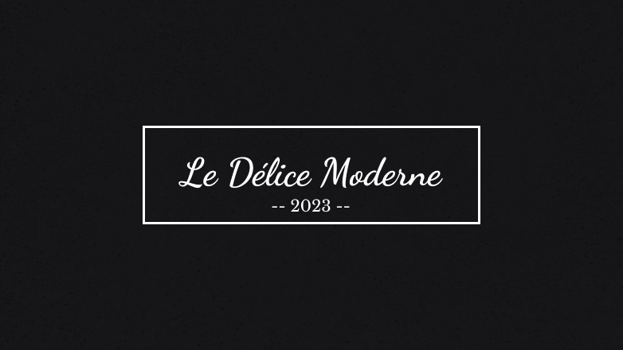

# Le Délice Moderne

> Status: 🟡 - Conception and research

Le Délice Moderne is a ficcional restaurant created by me while improving front-end skills. Learn a bit about the story of this project:

## Features ideas

- [ ] Reservation
- [ ] Location map
- [ ] Online menu

## About the restaurant

Located in the city of Aracaju, Le Délice Moderne is a charming restaurant that combines the best of French cuisine with a contemporary twist. Our proposal is to offer a unique gastronomic experience, with varied and delicious dishes prepared with fresh and selected ingredients.

Our restaurant is located in a park with a stunning green area, providing a peaceful and welcoming environment for our customers. With a modern rustic architecture, our facilities are an invitation to elegance and comfort, perfect for special moments, romantic dinners, or meetings with friends and family.

At Le Délice Moderne, our menu is carefully elaborated to satisfy the most demanding palates. Our talented chefs create dishes that blend the authenticity of French cuisine with contemporary influences, resulting in an incredible fusion of flavors. From classics like Boeuf Bourguignon to vegetarian dishes and more traditional sandwiches, we have something for everyone.

In addition to our outstanding cuisine, our attentive and professional staff is ready to welcome you with open arms, providing impeccable service and ensuring that each visit to Le Délice Moderne is a memorable experience.

Come visit us and allow yourself to enjoy a charming atmosphere, delicious dishes, and unforgettable moments. At Le Délice Moderne, we are committed to offering the best of French gastronomy in a modern and welcoming environment. We look forward to welcoming you soon!

### 🔣 Translate  
- [Português](https://bit.ly/43EZOdJ)
- [Deutsch](https://bit.ly/3OUImhh)
- [Español](https://bit.ly/3IQfJht)

## Used content

Much of content used in this project is AI-generated. All third-party content is going to be listed and attributed below:

### Ambiance

- https://pin.it/2ITexAb
- https://pin.it/5RWEt6n
- https://pin.it/4vlW3GW
- https://pin.it/7dUaCBs

## Technologies

 
  
  

 

## Stack

- [Astro Build](https://astro.build/)
- [Tailwindcss](https://tailwindcss.com/)
- [React Icons](https://react-icons.github.io/react-icons/)
- [Fontsource](https://fontsource.org/)
- [ChatGPT](https://chat.openai.com/)
- [Pinterest](https://pinterest.com/)
- [Reddit](https://www.reddit.com/)

## License

GNU GPLv3 by Wolney Oliveira
